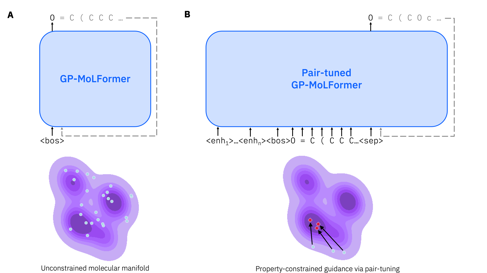

# GP-MoLFormer
[](https://arxiv.org/abs/2405.04912)

Code and data for **G**enerative **P**re-trained **M**olecular **L**anguage trans**F**ormers (GP-MoLFormer) & pair-tuning.



GP-MoLFormer is a large-scale autoregressive chemical language model intended for molecule generation tasks. GP-MoLFormer employs the same architecture as [MoLFormer-XL](https://github.com/IBM/molformer), including linear attention and rotary position embeddings, but uses decoder-only Transformer blocks trained with a causal language modeling objective. It is trained on up to 1.1B molecules in SMILES representation.

GP-MoLFormer was evaluated on _de novo_ generation (at scale), scaffold-constrained decoration, and molecular property optimization tasks. Unconstrained property optimization was performed using a novel parameter-efficient fine-tuning method we call "pair-tuning". Pair-tuning is a soft prompt learning method which uses only ordered pairs of inputs to steer the model's generations in the direction implied by the data.

## Models

| Model  | Parameters | Training size | Link |
| ------ | ---------- | ------------- | ---- |
| GP-MoLFormer  | 46.8M | 1.1B  |  |
| GP-MoLFormer-Uniq  | 46.8M | 650M  | [](https://huggingface.co/ibm-research/GP-MoLFormer-Uniq) |

## Installation
We recommend using mamba for virtual environment management (although this can be substituted with conda).

```sh
mamba env create -f environment.yml
```

To use the LAMB optimizer, you need to install APEX:

```sh
pip install --disable-pip-version-check --no-cache-dir --no-build-isolation --config-settings "--build-option=--cpp_ext" --config-settings "--build-option=--cuda_ext" ./
```

Optionally, for pre-training, you should also install fast_transformers:

```sh
pip install pytorch-fast-transformers==0.4.0
```

## Examples
For unconditional (de novo) generation, run:

```sh
python scripts/unconditional_generation.py --num_batches 1 uncond.csv
```

For conditional (e.g., scaffold-constrained) generation, run:

```sh
python scripts/conditional_generation.py c1cccc
```

For pair-tuning on QED, run:

```sh
python scripts/pairtune_training.py qed --lamb
```

## Pre-training
GP-MoLFormer can be pre-trained using HuggingFace. See [data/README.md](data/README.md) for instructions on downloading the pre-training data.

## Citation
```
@misc{ross2024gpmolformerfoundationmodelmolecular,
      title={GP-MoLFormer: A Foundation Model For Molecular Generation},
      author={Jerret Ross and Brian Belgodere and Samuel C. Hoffman and Vijil Chenthamarakshan and Youssef Mroueh and Payel Das},
      year={2024},
      eprint={2405.04912},
      archivePrefix={arXiv},
      primaryClass={q-bio.BM},
      url={https://arxiv.org/abs/2405.04912},
}
```

## Disclosure
All content in these repositories including code has been provided by IBM under the associated open source software license and IBM is under no obligation to provide enhancements, updates, or support. IBM developers produced this code as an open source project (not as an IBM product), and IBM makes no assertions as to the level of quality nor security, and will not be maintaining this code going forward.
